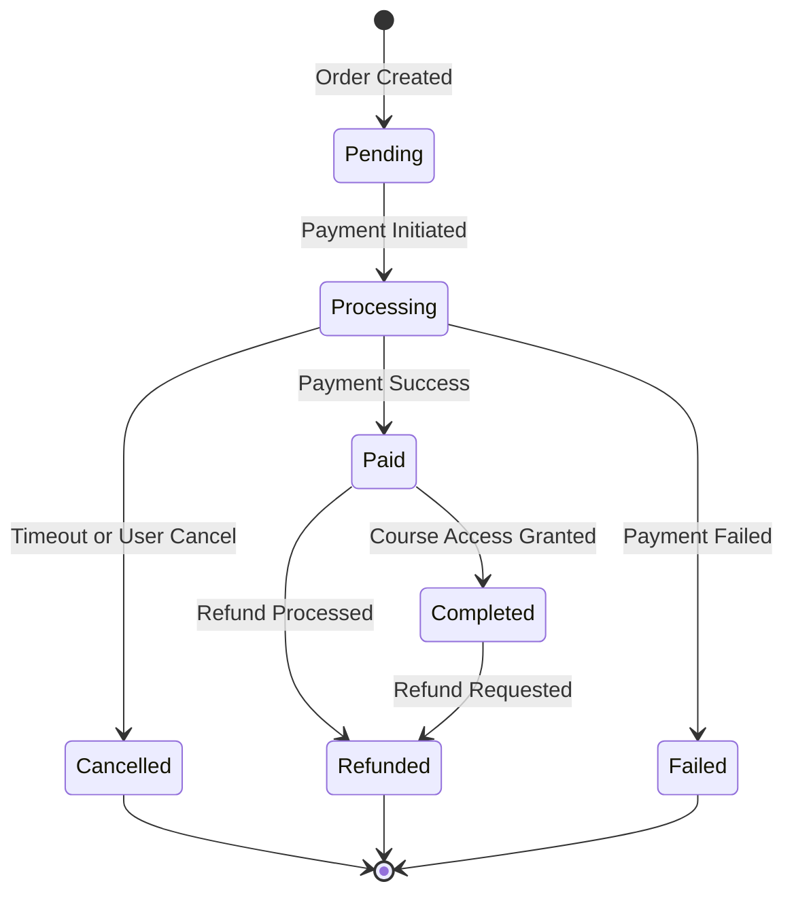

# Developer-Facing PRD Example: Online Education Platform Course Purchase Feature

## Document Information

- **Document Title**: Online Education Platform Course Purchase Feature Technical Specifications
- **Version**: v1.0
- **Creation Date**: 2026-03-20
- **Author**: Technical Lead Wang Wu
- **Business PRD Reference**: [Customer-Facing PRD - Course Purchase Feature](customer-facing-prd-example.md)
- **Status**: Approved

## 1. Problem Context

### Business Background
The business team has identified a significant revenue loss (¥200,000 monthly) due to the lack of online course purchase functionality. Current offline purchase processes result in low conversion rates (5%) and poor customer satisfaction (3.2/5). The business goals are:
1. Increase conversion rate to 15%
2. Reduce purchase time to under 3 minutes
3. Achieve customer satisfaction score ≥ 4.5/5
4. Reduce manual processing by 80%

### Technical Context
The current system consists of:
- User authentication service (JWT-based)
- Course management service (REST API)
- Existing payment partnerships with Alipay and WeChat Pay
- MySQL database for course and user data
- Redis for session management
- Nginx for load balancing

### Current System Analysis
| Component | Current State | Impact on New Implementation |
|-----------|---------------|------------------------------|
| User Service | Supports login/registration | Needs extension for purchase history |
| Course Service | Course listing and details | Needs inventory management integration |
| Payment Gateway | Not implemented | New integration required |
| Order System | Not implemented | New system required |
| Notification Service | Email only | Needs SMS and push notification support |

## 2. Goals and Non-Goals

### Technical Goals
- **Goal 1**: Implement secure online payment processing with Alipay and WeChat Pay
  - **Business Justification**: Enables direct revenue collection and reduces manual processing
  - **Success Criteria**: Payment success rate > 99%, processing time < 2 seconds
  - **Priority**: High

- **Goal 2**: Build real-time shopping cart and order management system
  - **Business Justification**: Enables multi-course purchases and streamlined checkout
  - **Success Criteria**: Cart updates < 1 second, order processing < 30 seconds
  - **Priority**: High

- **Goal 3**: Create automated invoicing and notification system
  - **Business Justification**: Reduces manual work and improves customer experience
  - **Success Criteria**: Invoice generation < 30 seconds, delivery within 1 minute
  - **Priority**: Medium

- **Goal 4**: Implement analytics and reporting for business metrics
  - **Business Justification**: Enables tracking of conversion rates and business KPIs
  - **Success Criteria**: Real-time dashboard with < 5 second data refresh
  - **Priority**: Medium

### Non-Goals (Explicitly Out of Scope)
- **Non-Goal 1**: International payment processing (currency conversion, international gateways)
  - **Reason**: Current focus is Chinese market only
  - **Alternative**: Use existing domestic payment providers

- **Non-Goal 2**: Subscription-based payment model
  - **Reason**: Business team has not approved subscription pricing
  - **Alternative**: Implement one-time purchases initially

## 3. Scope Definition

### In Scope
- **Purchase Service**: Core purchase processing and order management
  - **Responsibility**: Handle purchase requests, payment processing, order fulfillment
  - **Boundaries**: From cart checkout to order confirmation
  - **Interfaces**: Payment gateway APIs, User service, Course service, Notification service

- **Cart Service**: Shopping cart management and pricing calculations
  - **Responsibility**: Maintain user shopping carts, calculate totals, apply discounts
  - **Boundaries**: Cart operations only, no payment processing
  - **Interfaces**: User service, Course service, Pricing service

- **Payment Integration**: Alipay and WeChat Pay gateway integration
  - **Responsibility**: Process payments, handle callbacks, manage refunds
  - **Boundaries**: Payment processing only, no business logic
  - **Interfaces**: External payment gateways, Order service

- **Invoice Service**: Automated invoice generation and delivery
  - **Responsibility**: Generate invoices, send via email/SMS, maintain records
  - **Boundaries**: Invoice processing only, no payment processing
  - **Interfaces**: Order service, Notification service, Storage service

### Out of Scope
- **Course Management**: Course creation and content management (existing system)
- **User Management**: User registration and authentication (existing system)
- **Reporting Dashboard**: Business intelligence and analytics (separate project)

## 4. Functional Requirements

### FR-001: Shopping Cart Management
**Description**: Users can add courses to shopping cart, modify quantities, remove items, and view cart summary with pricing calculations.
**Priority**: Must Have
**Business Reference**: Customer PRD Section 4.1, Feature 2

**Input Specification**:
```json
{
  "action": "add|remove|update",
  "course_id": "string (UUID)",
  "quantity": "integer (default: 1, max: 10)",
  "user_id": "string (UUID)"
}
```

**Processing Logic**:
1. Validate user authentication and authorization
2. Check course availability and inventory
3. Calculate price including any applicable discounts
4. Update cart in Redis with TTL of 30 minutes
5. Return updated cart with total amount

**Output Specification**:
```json
{
  "cart_id": "string (UUID)",
  "items": [
    {
      "course_id": "string",
      "course_name": "string",
      "quantity": "integer",
      "unit_price": "decimal",
      "total_price": "decimal"
    }
  ],
  "subtotal": "decimal",
  "discount": "decimal",
  "total": "decimal",
  "currency": "CNY"
}
```

**Error Conditions**:
| Error Code | Description | Trigger | Recovery Action |
|------------|-------------|---------|-----------------|
| CART-001 | Course not found | Invalid course_id | Return 404 with error message |
| CART-002 | Course out of stock | Inventory = 0 | Return 409 with stock status |
| CART-003 | Cart limit exceeded | > 10 items | Return 400 with limit message |

**Acceptance Criteria**:
- [ ] Cart updates in real-time across all user devices
- [ ] Price calculations accurate to 2 decimal places
- [ ] Cart persists for 30 minutes of inactivity
- [ ] All operations complete within 1 second

### FR-002: Payment Processing
**Description**: Process payments through Alipay and WeChat Pay with support for synchronous and asynchronous payment flows.
**Priority**: Must Have
**Business Reference**: Customer PRD Section 4.1, Feature 3

**Input Specification**:
```json
{
  "order_id": "string (UUID)",
  "payment_method": "alipay|wechat",
  "amount": "decimal",
  "currency": "CNY",
  "return_url": "string (URL)",
  "notify_url": "string (URL)"
}
```

**Processing Logic**:
1. Validate order details and payment amount
2. Create payment record with status "pending"
3. Generate payment request to selected gateway
4. Return payment URL for user redirection
5. Handle asynchronous payment notification
6. Update order status based on payment result

**Output Specification**:
```json
{
  "payment_id": "string (UUID)",
  "payment_url": "string (URL)",
  "qr_code": "string (base64, for WeChat)",
  "expires_at": "datetime (ISO 8601)"
}
```

**Error Conditions**:
| Error Code | Description | Trigger | Recovery Action |
|------------|-------------|---------|-----------------|
| PAY-001 | Payment timeout | Payment not completed in 30 minutes | Cancel order, update inventory |
| PAY-002 | Payment failed | Gateway returns failure | Notify user, allow retry |
| PAY-003 | Duplicate payment | Same order paid twice | Refund duplicate payment |

**Acceptance Criteria**:
- [ ] Payment processing time < 2 seconds for 95% of requests
- [ ] Payment success rate > 99%
- [ ] Support concurrent processing of 1000 payments
- [ ] Handle payment callbacks within 5 seconds

### FR-003: Order Management
**Description**: Create and manage orders throughout the purchase lifecycle from creation to completion.
**Priority**: Must Have
**Business Reference**: Customer PRD Section 4.1, Feature 4

**Input Specification**:
```json
{
  "user_id": "string (UUID)",
  "cart_id": "string (UUID)",
  "payment_method": "alipay|wechat",
  "coupon_codes": ["string"]
}
```

**Processing Logic**:
1. Validate cart contents and pricing
2. Apply any discount coupons
3. Create order with status "pending"
4. Reserve inventory for purchased courses
5. Initiate payment process
6. Update order status based on payment result
7. Grant course access upon successful payment

**Output Specification**:
```json
{
  "order_id": "string (UUID)",
  "order_number": "string (human-readable)",
  "status": "pending|paid|cancelled|refunded",
  "items": [],
  "subtotal": "decimal",
  "discount": "decimal",
  "total": "decimal",
  "created_at": "datetime",
  "payment_url": "string"
}
```

**Error Conditions**:
| Error Code | Description | Trigger | Recovery Action |
|------------|-------------|---------|-----------------|
| ORDER-001 | Invalid cart | Cart empty or expired | Return 400 with error message |
| ORDER-002 | Price mismatch | Price changed during checkout | Recalculate and notify user |
| ORDER-003 | Inventory conflict | Course sold out during checkout | Cancel order, update cart |

**Acceptance Criteria**:
- [ ] Order creation time < 3 seconds
- [ ] Order status updates in real-time
- [ ] Support 500 concurrent order creations
- [ ] Order data retained for 7 years

### FR-004: Invoice Generation
**Description**: Automatically generate and deliver invoices for completed purchases.
**Priority**: Should Have
**Business Reference**: Customer PRD Section 4.1, Feature 4

**Input Specification**:
```json
{
  "order_id": "string (UUID)",
  "invoice_type": "electronic|paper",
  "invoice_title": "string",
  "tax_id": "string (optional)"
}
```

**Processing Logic**:
1. Validate order completion status
2. Generate invoice PDF with order details
3. Store invoice in cloud storage
4. Send invoice via email and SMS
5. Log invoice generation for audit

**Output Specification**:
```json
{
  "invoice_id": "string (UUID)",
  "invoice_number": "string",
  "pdf_url": "string (URL)",
  "total_amount": "decimal",
  "tax_amount": "decimal",
  "generated_at": "datetime"
}
```

**Error Conditions**:
| Error Code | Description | Trigger | Recovery Action |
|------------|-------------|---------|-----------------|
| INV-001 | Invalid invoice request | Order not completed | Return 400 with error message |
| INV-002 | Generation failed | PDF generation error | Retry up to 3 times, then alert |
| INV-003 | Delivery failed | Email/SMS delivery failure | Log failure, retry after 1 hour |

**Acceptance Criteria**:
- [ ] Invoice generation within 30 seconds of payment
- [ ] PDF size < 500KB
- [ ] Email delivery within 1 minute
- [ ] Support 1000 concurrent invoice generations

## 5. Non-Functional Requirements

### 5.1 Performance Requirements
| Requirement | Target | Measurement Method | Priority |
|-------------|--------|-------------------|----------|
| API Response Time | < 200ms (95th percentile) | Application monitoring | High |
| Payment Processing | < 2 seconds | Payment gateway logs | High |
| Concurrent Users | > 1000 users | Load testing | High |
| Database Queries | < 50ms | Database monitoring | Medium |
| Cache Hit Rate | > 90% | Redis monitoring | Medium |

### 5.2 Security Requirements
| Requirement | Specification | Compliance Standard |
|-------------|---------------|---------------------|
| Authentication | JWT with 1-hour expiration | OAuth 2.0 |
| Authorization | Role-based access control | RBAC |
| Data Encryption | AES-256 for sensitive data | PCI DSS |
| API Security | Rate limiting, input validation | OWASP Top 10 |
| Audit Logging | All payment operations logged | SOC 2 |

### 5.3 Reliability Requirements
| Requirement | Target | Measurement Method |
|-------------|--------|-------------------|
| System Availability | > 99.9% | Uptime monitoring |
| Recovery Time Objective | < 5 minutes | Disaster recovery testing |
| Data Recovery Point | < 1 minute | Backup monitoring |
| Payment Success Rate | > 99% | Payment gateway logs |

### 5.4 Scalability Requirements
- **Horizontal Scaling**: Auto-scale between 2-10 application instances based on load
- **Vertical Scaling**: Support up to 8 CPU cores and 16GB RAM per instance
- **Database Scaling**: Read replicas for reporting queries
- **Cache Scaling**: Redis cluster with automatic sharding

## 6. Data/State Model

### 6.1 Entity Definitions

#### Entity: Order
```json
{
  "id": "UUID (primary key)",
  "order_number": "string (unique, human-readable, format: ORD-YYYYMMDD-XXXX)",
  "user_id": "UUID (foreign key to users)",
  "status": "enum[pending, paid, cancelled, refunded, completed]",
  "subtotal": "decimal(10,2)",
  "discount_amount": "decimal(10,2)",
  "total_amount": "decimal(10,2)",
  "currency": "string (default: CNY)",
  "payment_method": "enum[alipay, wechat, bank_transfer]",
  "payment_id": "UUID (foreign key to payments)",
  "coupon_codes": "json array",
  "created_at": "timestamp",
  "updated_at": "timestamp",
  "completed_at": "timestamp (nullable)",
  "version": "integer (optimistic locking)"
}
```

**Validation Rules**:
- Order number must match pattern ORD-[0-9]{8}-[0-9]{4}
- Total amount must equal subtotal minus discount
- Status transitions must follow defined state machine

#### Entity: OrderItem
```json
{
  "id": "UUID (primary key)",
  "order_id": "UUID (foreign key to orders)",
  "course_id": "UUID (foreign key to courses)",
  "course_name": "string",
  "quantity": "integer (default: 1)",
  "unit_price": "decimal(10,2)",
  "total_price": "decimal(10,2)",
  "created_at": "timestamp"
}
```

#### Entity: Payment
```json
{
  "id": "UUID (primary key)",
  "order_id": "UUID (foreign key to orders)",
  "gateway": "enum[alipay, wechat]",
  "gateway_transaction_id": "string",
  "amount": "decimal(10,2)",
  "currency": "string",
  "status": "enum[pending, processing, success, failed, refunded]",
  "error_code": "string (nullable)",
  "error_message": "string (nullable)",
  "paid_at": "timestamp (nullable)",
  "created_at": "timestamp",
  "updated_at": "timestamp"
}
```

### 6.2 State Transitions


**State Definitions**:
| State | Description | Valid Transitions |
|-------|-------------|-------------------|
| Pending | Order created, awaiting payment | → Processing, → Cancelled |
| Processing | Payment in progress | → Paid, → Failed, → Cancelled |
| Paid | Payment successful, processing fulfillment | → Completed, → Refunded |
| Failed | Payment failed or timeout | → [*] (terminal) |
| Cancelled | Order cancelled by user or system | → [*] (terminal) |
| Completed | Course access granted to user | → Refunded |
| Refunded | Payment refunded to user | → [*] (terminal) |

### 6.3 Relationships
- **User → Orders**: One-to-many (user can have multiple orders)
- **Order → OrderItems**: One-to-many (order contains multiple course items)
- **Order → Payment**: One-to-one (each order has one payment record)
- **Course → OrderItems**: One-to-many (course can appear in multiple order items)

## 7. Interfaces and Integrations

### 7.1 API Endpoints

#### POST /api/v1/orders
**Purpose**: Create new order from shopping cart
**Authentication**: Bearer JWT token required

**Request**:
```json
{
  "cart_id": "string (UUID)",
  "payment_method": "alipay|wechat",
  "coupon_codes": ["SAVE10"],
  "invoice_required": true,
  "invoice_title": "Personal"
}
```

**Response (Success - 201)**:
```json
{
  "order_id": "550e8400-e29b-41d4-a716-446655440000",
  "order_number": "ORD-20260320-0001",
  "status": "pending",
  "total_amount": 269.10,
  "payment_url": "https://payment.example.com/pay/xxx",
  "expires_at": "2026-03-20T10:30:00Z"
}
```

**Response (Error - 400)**:
```json
{
  "error": {
    "code": "ORDER-001",
    "message": "Cart is empty or expired",
    "details": "Cart ID: xxx has expired after 30 minutes"
  }
}
```

#### POST /api/v1/payments/alipay/notify
**Purpose**: Receive asynchronous payment notification from Alipay
**Authentication**: Signature verification

**Request**:
```json
{
  "out_trade_no": "ORD-20260320-0001",
  "trade_no": "2026032021001004010200000001",
  "trade_status": "TRADE_SUCCESS",
  "total_amount": "269.10",
  "buyer_id": "2088102123456789",
  "gmt_payment": "2026-03-20T10:15:30+08:00",
  "sign": "xxx",
  "sign_type": "RSA2"
}
```

**Response**:
```json
{
  "return_code": "success",
  "return_message": "OK"
}
```

### 7.2 External Integrations
| Service | Purpose | Protocol | Authentication |
|---------|---------|----------|----------------|
| Alipay Gateway | Process Alipay payments | HTTPS, RSA2 signature | Merchant private key |
| WeChat Pay Gateway | Process WeChat payments | HTTPS, API key + certificate | API key + certificate |
| SMS Service | Send payment notifications | HTTP REST API | API key |
| Email Service | Send invoices and receipts | SMTP/API | OAuth 2.0 |
| Cloud Storage | Store invoice PDFs | S3-compatible API | Access key + secret |

### 7.3 Event Definitions

#### Payment Success Event
```json
{
  "event_type": "payment.success",
  "event_id": "evt_1234567890",
  "timestamp": "2026-03-20T10:15:30Z",
  "payload": {
    "order_id": "550e8400-e29b-41d4-a716-446655440000",
    "order_number": "ORD-20260320-0001",
    "user_id": "660e8400-e29b-41d4-a716-446655440000",
    "amount": 269.10,
    "payment_method": "alipay",
    "paid_at": "2026-03-20T10:15:30Z"
  },
  "metadata": {
    "source": "payment-service",
    "version": "1.0"
  }
}
```

#### Order Completed Event
```json
{
  "event_type": "order.completed",
  "event_id": "evt_1234567891",
  "timestamp": "2026-03-20T10:16:00Z",
  "payload": {
    "order_id": "550e8400-e29b-41d4-a716-446655440000",
    "order_number": "ORD-20260320-0001",
    "user_id": "660e8400-e29b-41d4-a716-446655440000",
    "course_ids": ["770e8400-e29b-41d4-a716-446655440000"],
    "completed_at": "2026-03-20T10:16:00Z"
  },
  "metadata": {
    "source": "order-service",
    "version": "1.0"
  }
}
```

## 8. Error Handling and Edge Cases

### Error Matrix
| Error Code | HTTP Status | Description | User Message | Recovery Action |
|------------|-------------|-------------|--------------|-----------------|
| ORDER-001 | 400 | Invalid cart | "Your cart is empty or has expired. Please add courses again." | Clear invalid cart, redirect to courses |
| ORDER-002 | 409 | Price changed | "The price has changed. Please review your cart." | Recalculate cart, show new prices |
| ORDER-003 | 409 | Inventory conflict | "One or more courses are no longer available." | Update cart, remove unavailable items |
| PAY-001 | 408 | Payment timeout | "Payment timed out. Please try again." | Cancel pending payment, allow retry |
| PAY-002 | 402 | Payment failed | "Payment failed. Please check your payment method." | Log failure, suggest alternative payment |
| PAY-003 | 409 | Duplicate payment | "This order has already been paid." | Refund duplicate payment automatically |
| INV-001 | 400 | Invalid invoice request | "Cannot generate invoice for this order." | Check order status, provide explanation |
| INV-002 | 500 | Generation failed | "Invoice generation failed. We will send it shortly." | Retry generation, queue for later delivery |

### Edge Cases
| Scenario | Expected Behavior | Validation Method |
|----------|-------------------|-------------------|
| User closes browser during payment | Order remains pending for 30 minutes, then auto-cancels | Test with browser close simulation |
| Network timeout during payment callback | Retry callback up to 3 times with exponential backoff | Simulate network failures |
| Concurrent purchase of same course | Inventory properly decremented, no overselling | Load test with 100 concurrent users |
| User changes payment method mid-flow | Cancel previous payment attempt, start new one | Test payment method switching |
| Large number of courses in cart | Process successfully, but limit to 10 items max | Test with 10+ items in cart |

### Failure Modes
| Failure Mode | Detection Method | Impact | Mitigation |
|--------------|------------------|--------|------------|
| Payment gateway unavailable | Health check endpoint failure | Cannot process payments | Fallback to alternative gateway, queue payments |
| Database connection lost | Connection pool exhaustion | Cannot create orders | Circuit breaker, retry with backoff |
| Cache (Redis) failure | Cache miss rate > 50% | Slower performance | Direct database queries, graceful degradation |
| Message queue backlog | Queue length > 1000 messages | Delayed notifications | Auto-scaling consumers, priority queuing |

## 9. Dependencies and Constraints

### Technical Dependencies
| Dependency | Version | Purpose | Fallback Option |
|------------|---------|---------|-----------------|
| MySQL | 8.0+ | Primary database | PostgreSQL 13+ |
| Redis | 6.0+ | Session and cart storage | In-memory cache with persistence |
| RabbitMQ | 3.8+ | Message queue | Apache Kafka |
| Alipay SDK | 3.0+ | Payment integration | Direct API calls |
| WeChat Pay SDK | 3.0+ | Payment integration | Direct API calls |

### System Constraints
- **Hardware**: Minimum 4 CPU cores, 8GB RAM per application instance
- **Software**: Java 11+, Spring Boot 2.5+, PostgreSQL 13+ or MySQL 8.0+
- **Network**: Low latency (< 50ms) between application and database
- **Storage**: Minimum 100GB SSD for database, 500GB for file storage

### Business Constraints
- **Timeline**: Phase 1 must be complete by 2026-05-15
- **Budget**: Development budget limited to ¥500,000
- **Resources**: 4 developers, 1 QA engineer, 1 DevOps engineer
- **Compliance**: Must comply with PCI DSS for payment processing

## 10. Acceptance Criteria

### Technical Acceptance Criteria
- [ ] **Criterion 1**: All API endpoints respond within 200ms for 95th percentile
  - **Test Method**: Load testing with 1000 concurrent users
  - **Expected Result**: 95% of requests complete within 200ms
  - **Priority**: High

- [ ] **Criterion 2**: Payment processing succeeds for 99% of valid transactions
  - **Test Method**: Integration testing with sandbox payment gateways
  - **Expected Result**: 99% success rate for valid payment requests
  - **Priority**: High

- [ ] **Criterion 3**: System handles 500 concurrent order creations
  - **Test Method**: Stress testing with gradual load increase
  - **Expected Result**: No errors or timeouts at 500 concurrent users
  - **Priority**: High

- [ ] **Criterion 4**: Order state transitions follow defined state machine
  - **Test Method**: Unit and integration testing of state transitions
  - **Expected Result**: All valid transitions work, invalid transitions rejected
  - **Priority**: Medium

### Performance Acceptance Criteria
- [ ] Response time under load: < 200ms for 95% of requests at 1000 TPS
- [ ] Concurrent user support: 1000 users with < 10% performance degradation
- [ ] System availability: > 99.9% over 30-day period

### Security Acceptance Criteria
- [ ] All endpoints authenticated with valid JWT tokens
- [ ] Payment data encrypted with AES-256 at rest
- [ ] API rate limiting prevents abuse (100 requests/minute per user)
- [ ] No sensitive data exposed in logs or error messages

## 11. Testing Requirements

### Unit Testing
- **Coverage Requirement**: > 90% code coverage
- **Test Framework**: JUnit 5 with Mockito
- **Mocking Strategy**: Mock all external dependencies (payment gateways, databases)
- **Test Data**: Use factory pattern for test data creation

### Integration Testing
- **Scope**: All API endpoints, database operations, message queue interactions
- **Environment**: Docker Compose with test containers
- **Data Requirements**: Seed data for courses, users, and test scenarios
- **Cleanup**: Automatic cleanup after each test suite

### End-to-End Testing
- **User Scenarios**: 
  1. Complete purchase flow from cart to course access
  2. Payment failure and retry flow
  3. Invoice generation and delivery flow
- **Environment**: Staging environment with sandbox payment gateways
- **Automation**: Selenium/Playwright for UI testing, Postman for API testing

### Performance Testing
- **Load Test**: 1000 concurrent users for 30 minutes
- **Stress Test**: Gradual increase from 100 to 2000 users
- **Soak Test**: 100 concurrent users for 24 hours
- **Tools**: JMeter, Gatling, or k6

## 12. Risks and Mitigation Strategies

| Risk | Probability | Impact | Mitigation Strategy | Owner |
|------|-------------|--------|---------------------|-------|
| Payment gateway API changes | Medium | High | Version pinning, API monitoring, contract tests | DevOps Team |
| Database performance degradation | Medium | Medium | Query optimization, indexing, read replicas | Database Team |
| High concurrent purchase load | Medium | High | Auto-scaling, caching, queue-based processing | DevOps Team |
| Security vulnerability in payment flow | Low | High | Regular security audits, penetration testing | Security Team |
| Third-party service downtime | Low | Medium | Circuit breakers, fallback mechanisms | Architecture Team |

## 13. Open Questions and Decisions Needed

### Technical Decisions
- [ ] **Decision 1**: Should we use synchronous or asynchronous payment processing?
  - **Options**: 
    - Option A: Synchronous (simpler, but blocks user)
    - Option B: Asynchronous (better UX, but more complex)
  - **Decision Maker**: Technical Lead Wang Wu
  - **Deadline**: 2026-03-25

- [ ] **Decision 2**: Should we implement idempotency keys for payment processing?
  - **Options**:
    - Option A: Yes, with Redis-based idempotency store
    - Option B: No, rely on database unique constraints
  - **Decision Maker**: Technical Lead Wang Wu
  - **Deadline**: 2026-03-25

### Open Technical Questions
- [ ] **Question 1**: What is the maximum acceptable payment processing latency?
  - **Impact**: Affects user experience and payment success rate
  - **Owner**: Product Manager Zhang San

- [ ] **Question 2**: Should we support partial refunds for multi-course orders?
  - **Impact**: Affects order and payment data model complexity
  - **Owner**: Business Leader Li Si

## 14. Approval and Sign-off

### Review History
| Version | Date | Reviewer | Comments | Status |
|---------|------|----------|----------|--------|
| v0.1 | 2026-03-15 | Dev Team | Initial technical draft | Draft |
| v0.9 | 2026-03-18 | Architect | Added scalability requirements | In Review |
| v1.0 | 2026-03-20 | All Stakeholders | Final approval | Approved |

### Technical Approval
- **Technical Lead**: Wang Wu
- **Approval Date**: 2026-03-20
- **Signature**: [Digital signature or confirmation]

## Integration with Business Requirements

This developer-facing PRD must be used in conjunction with:
- **Customer-Facing PRD**: Business requirements and success criteria (linked above)
- **Acceptance Criteria Template**: Detailed acceptance criteria for each feature
- **Design Specifications**: UI/UX specifications for the purchase flow (separate document)

## Related Documents

- `spec.universal-domains.product-and-requirements.prd-documentation-developer-facing`: Developer-facing PRD specification
- `checklist.universal-domains.product-and-requirements.developer-facing-prd-checklist`: Checklist for validating developer-facing PRDs
- `example.universal-domains.product-and-requirements.customer-facing-prd-example`: Corresponding customer-facing PRD example
- `template.universal-domains.product-and-requirements.developer-facing-prd-template`: Template for developer-facing PRDs