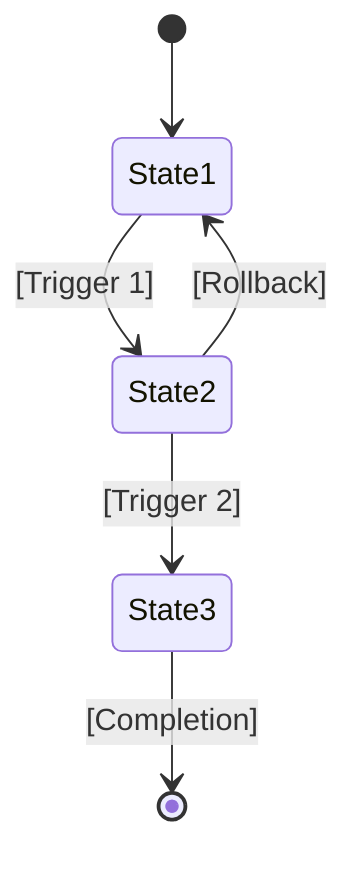

# Developer-Facing PRD Template

## Purpose

Use this template to create developer-facing Product Requirement Documents (PRDs) that translate business requirements into implementation-ready technical specifications. This template ensures all necessary technical details are included for development, testing, and deployment.

## Instructions

1. **Fill in all sections**: Complete each section with specific technical information
2. **Be precise**: Use exact specifications, formats, and measurable criteria
3. **Reference business context**: Link to the corresponding customer-facing PRD
4. **Include examples**: Provide concrete examples of inputs, outputs, and behaviors
5. **Review with technical team**: Have developers and architects review for completeness

## Document Information

- **Document Title**: [Technical specification title]
- **Version**: [Version number, e.g., v1.0]
- **Creation Date**: [Date document was created]
- **Author**: [Name of technical author]
- **Business PRD Reference**: [Link to customer-facing PRD]
- **Status**: [Draft/In Review/Approved/Rejected]

## 1. Problem Context

### Business Background
[Summarize the business problem or opportunity from the customer-facing PRD. Include the business goals and success metrics that drive this technical implementation.]

### Technical Context
[Describe the current technical situation, including existing systems, architecture, and technical constraints that affect this implementation.]

### Current System Analysis
| Component | Current State | Impact on New Implementation |
|-----------|---------------|------------------------------|
| [Component 1] | [Description] | [How it affects new work] |
| [Component 2] | [Description] | [How it affects new work] |

## 2. Goals and Non-Goals

### Technical Goals
- **Goal 1**: [Specific technical objective]
  - **Business Justification**: [Why this goal matters for the business]
  - **Success Criteria**: [How to measure achievement]
  - **Priority**: [High/Medium/Low]

- **Goal 2**: [Specific technical objective]
  - **Business Justification**: [Why this goal matters for the business]
  - **Success Criteria**: [How to measure achievement]
  - **Priority**: [High/Medium/Low]

### Non-Goals (Explicitly Out of Scope)
- **Non-Goal 1**: [What will not be addressed]
  - **Reason**: [Why this is not included]
  - **Alternative**: [Any alternative approach]

## 3. Scope Definition

### In Scope
- **Module/Component 1**: [Name and description]
  - **Responsibility**: [What this component is responsible for]
  - **Boundaries**: [Clear boundaries of responsibility]
  - **Interfaces**: [How it interacts with other components]

- **Module/Component 2**: [Name and description]
  - **Responsibility**: [What this component is responsible for]
  - **Boundaries**: [Clear boundaries of responsibility]
  - **Interfaces**: [How it interacts with other components]

### Out of Scope
- **Component 1**: [Name]
  - **Reason**: [Why this is not included]
  - **Impact**: [How this affects the implementation]

## 4. Functional Requirements

### FR-001: [Requirement Name]
**Description**: [Detailed description of what the system must do]
**Priority**: [Must Have/Should Have/Could Have/Won't Have]
**Business Reference**: [Link to business requirement]

**Input Specification**:
```json
{
  "field1": "type (description)",
  "field2": "type (description)"
}
```

**Processing Logic**:
1. [Step 1 of processing]
2. [Step 2 of processing]
3. [Step 3 of processing]

**Output Specification**:
```json
{
  "result": "type (description)",
  "status": "enum[success, error, partial]"
}
```

**Error Conditions**:
| Error Code | Description | Trigger | Recovery Action |
|------------|-------------|---------|-----------------|
| ERR-001 | [Description] | [When this occurs] | [How to handle] |

**Acceptance Criteria**:
- [ ] [Specific, testable criterion 1]
- [ ] [Specific, testable criterion 2]

### FR-002: [Requirement Name]
[Repeat the same structure for additional functional requirements]

## 5. Non-Functional Requirements

### 5.1 Performance Requirements
| Requirement | Target | Measurement Method | Priority |
|-------------|--------|-------------------|----------|
| Response Time | < [X] ms | [How to measure] | High |
| Throughput | > [X] TPS | [How to measure] | High |
| Concurrent Users | > [X] users | [How to measure] | Medium |
| Memory Usage | < [X] MB | [How to measure] | Medium |

### 5.2 Security Requirements
| Requirement | Specification | Compliance Standard |
|-------------|---------------|---------------------|
| Authentication | [Specific requirements] | [Standard, e.g., OAuth 2.0] |
| Authorization | [Specific requirements] | [Standard, e.g., RBAC] |
| Data Encryption | [Specific requirements] | [Standard, e.g., AES-256] |
| Audit Logging | [Specific requirements] | [Standard, e.g., SOC 2] |

### 5.3 Reliability Requirements
| Requirement | Target | Measurement Method |
|-------------|--------|-------------------|
| Availability | > [X]% | [How to measure] |
| Recovery Time | < [X] minutes | [How to measure] |
| Data Loss | < [X] records | [How to measure] |
| Backup Frequency | Every [X] hours | [How to measure] |

### 5.4 Scalability Requirements
- **Horizontal Scaling**: [Requirements for scaling out]
- **Vertical Scaling**: [Requirements for scaling up]
- **Load Distribution**: [Requirements for load balancing]
- **Resource Allocation**: [Resource requirements and limits]

## 6. Data/State Model

### 6.1 Entity Definitions
#### Entity: [Entity Name]
```json
{
  "id": "string (UUID, unique identifier)",
  "field1": "type (constraints)",
  "field2": "type (constraints)",
  "created_at": "datetime (ISO 8601)",
  "updated_at": "datetime (ISO 8601)"
}
```

**Validation Rules**:
- [Rule 1]: [Description of validation]
- [Rule 2]: [Description of validation]

### 6.2 State Transitions


**State Definitions**:
| State | Description | Valid Transitions |
|-------|-------------|-------------------|
| State1 | [Description] | → State2 |
| State2 | [Description] | → State3, → State1 |
| State3 | [Description] | → [*] |

### 6.3 Relationships
- **Entity1 → Entity2**: [Type of relationship, e.g., one-to-many]
- **Entity2 → Entity3**: [Type of relationship, e.g., many-to-many]

## 7. Interfaces and Integrations

### 7.1 API Endpoints

#### POST /api/v1/resource
**Purpose**: [What this endpoint does]
**Authentication**: [Required authentication method]

**Request**:
```json
{
  "field1": "type (description)",
  "field2": "type (description)"
}
```

**Response (Success - 200)**:
```json
{
  "id": "string",
  "status": "success",
  "data": {}
}
```

**Response (Error - 400)**:
```json
{
  "error": {
    "code": "ERROR_CODE",
    "message": "Human-readable message"
  }
}
```

#### GET /api/v1/resource/{id}
[Repeat the same structure for additional endpoints]

### 7.2 External Integrations
| Service | Purpose | Protocol | Authentication |
|---------|---------|----------|----------------|
| [Service 1] | [Purpose] | [REST/GraphQL/etc] | [Auth method] |
| [Service 2] | [Purpose] | [REST/GraphQL/etc] | [Auth method] |

### 7.3 Event Definitions
```json
{
  "event_type": "event.name",
  "payload": {
    "field1": "type",
    "field2": "type"
  },
  "metadata": {
    "timestamp": "ISO 8601",
    "source": "service-name"
  }
}
```

## 8. Error Handling and Edge Cases

### Error Matrix
| Error Code | HTTP Status | Description | User Message | Recovery Action |
|------------|-------------|-------------|--------------|-----------------|
| AUTH-001 | 401 | Invalid credentials | "Login failed. Please check your credentials." | [Action] |
| AUTH-002 | 403 | Insufficient permissions | "You don't have permission to access this resource." | [Action] |
| DATA-001 | 400 | Invalid input format | "The data format is incorrect." | [Action] |
| DATA-002 | 404 | Resource not found | "The requested resource was not found." | [Action] |
| SYSTEM-001 | 500 | Internal server error | "An unexpected error occurred. Please try again." | [Action] |

### Edge Cases
| Scenario | Expected Behavior | Validation Method |
|----------|-------------------|-------------------|
| [Edge Case 1] | [How system should behave] | [How to test] |
| [Edge Case 2] | [How system should behave] | [How to test] |
| [Edge Case 3] | [How system should behave] | [How to test] |

### Failure Modes
| Failure Mode | Detection Method | Impact | Mitigation |
|--------------|------------------|--------|------------|
| [Failure 1] | [How to detect] | [Impact description] | [How to mitigate] |
| [Failure 2] | [How to detect] | [Impact description] | [How to mitigate] |

## 9. Dependencies and Constraints

### Technical Dependencies
| Dependency | Version | Purpose | Fallback Option |
|------------|---------|---------|-----------------|
| [Dependency 1] | [Version] | [Purpose] | [Alternative] |
| [Dependency 2] | [Version] | [Purpose] | [Alternative] |

### System Constraints
- **Hardware**: [Any hardware requirements or limitations]
- **Software**: [Software dependencies and compatibility]
- **Network**: [Network requirements and limitations]
- **Storage**: [Storage requirements and limitations]

### Business Constraints
- **Timeline**: [Any timeline constraints]
- **Budget**: [Any budget constraints]
- **Resources**: [Any resource constraints]
- **Compliance**: [Any compliance requirements]

## 10. Acceptance Criteria

### Technical Acceptance Criteria
- [ ] **Criterion 1**: [Specific, testable technical criterion]
  - **Test Method**: [How to verify]
  - **Expected Result**: [What should happen]
  - **Priority**: [High/Medium/Low]

- [ ] **Criterion 2**: [Specific, testable technical criterion]
  - **Test Method**: [How to verify]
  - **Expected Result**: [What should happen]
  - **Priority**: [High/Medium/Low]

### Performance Acceptance Criteria
- [ ] Response time under load: < [X] ms for [Y]% of requests
- [ ] Concurrent user support: [X] users with < [Y]% degradation
- [ ] System availability: > [X]% over [Y] day period

### Security Acceptance Criteria
- [ ] All endpoints authenticated and authorized
- [ ] Data encrypted in transit and at rest
- [ ] No sensitive data exposed in logs or error messages

## 11. Testing Requirements

### Unit Testing
- **Coverage Requirement**: > [X]% code coverage
- **Test Framework**: [Framework to use, e.g., JUnit, pytest]
- **Mocking Strategy**: [How to handle external dependencies]

### Integration Testing
- **Scope**: [What integration points to test]
- **Environment**: [Test environment requirements]
- **Data Requirements**: [Test data needs]

### End-to-End Testing
- **User Scenarios**: [Critical user flows to test]
- **Environment**: [Production-like environment requirements]
- **Automation**: [Automation requirements and tools]

### Performance Testing
- **Load Test**: [Load test requirements]
- **Stress Test**: [Stress test requirements]
- **Soak Test**: [Long-running test requirements]

## 12. Risks and Mitigation Strategies

| Risk | Probability | Impact | Mitigation Strategy | Owner |
|------|-------------|--------|---------------------|-------|
| [Risk 1] | High/Medium/Low | High/Medium/Low | [How to mitigate] | [Name] |
| [Risk 2] | High/Medium/Low | High/Medium/Low | [How to mitigate] | [Name] |
| [Risk 3] | High/Medium/Low | High/Medium/Low | [How to mitigate] | [Name] |

## 13. Open Questions and Decisions Needed

### Technical Decisions
- [ ] **Decision 1**: [What needs to be decided]
  - **Options**: [Available options with pros/cons]
  - **Decision Maker**: [Who needs to decide]
  - **Deadline**: [When decision is needed]

- [ ] **Decision 2**: [What needs to be decided]
  - **Options**: [Available options with pros/cons]
  - **Decision Maker**: [Who needs to decide]
  - **Deadline**: [When decision is needed]

### Open Technical Questions
- [ ] **Question 1**: [What needs to be clarified]
  - **Impact**: [Why this matters]
  - **Owner**: [Who is responsible]

## 14. Approval and Sign-off

### Review History
| Version | Date | Reviewer | Comments | Status |
|---------|------|----------|----------|--------|
| v1.0 | [Date] | [Reviewer] | [Comments] | [Status] |

### Technical Approval
- **Technical Lead**: [Name]
- **Approval Date**: [Date]
- **Signature**: [Signature or confirmation]

## Integration with Business Requirements

This developer-facing PRD must be used in conjunction with:
- **Customer-Facing PRD**: Business requirements and success criteria
- **Acceptance Criteria Template**: Detailed acceptance criteria
- **Design Specifications**: UI/UX specifications (if applicable)

## Related Documents

- `spec.universal-domains.product-and-requirements.prd-documentation-developer-facing`: Developer-facing PRD specification
- `checklist.universal-domains.product-and-requirements.developer-facing-prd-checklist`: Checklist for validating developer-facing PRDs
- `example.universal-domains.product-and-requirements.developer-facing-prd-example`: Example developer-facing PRD
- `template.universal-domains.product-and-requirements.acceptance-criteria-template`: Template for acceptance criteria