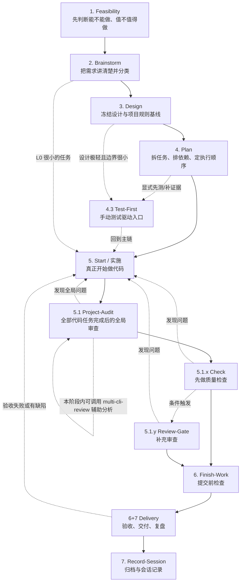

# 工作流全局流转说明（通俗版）

> 这份文档不是规则手册，而是“大局地图”。
> 目标是让你先看懂：这套 workflow 为什么这样设计、整条主链怎么走、什么时候该进哪一步。

相关文档：

- 想看权威规则：[工作流总纲](./工作流总纲.md)
- 想看阶段到命令的映射：[命令映射](./命令映射.md)
- 想看完整通用 walkthrough：[多CLI通用新项目完整流程演练](./多CLI通用新项目完整流程演练.md)
- 想看外部项目专项案例：[完整流程演练](./完整流程演练.md)

---

## 一句话理解这套 Workflow

这套流程的核心思想只有一句话：

**先判断值不值得做，再把需求说清楚，再冻结设计和检查门禁，最后才进入实现、审查、交付和记录。**

它要解决的不是“怎么让 AI 多写点代码”，而是下面四件事：

- 不让项目一开始就带着模糊需求往下冲
- 不让实现阶段边想边改、最后返工
- 不让不同 CLI 各说各话、入口混乱
- 不让任务做完之后没有证据、没有收尾、没有沉淀

在真正使用前，只要先记住一个前提：

- 目标项目必须本身是 Git 项目
- `origin` 必须至少配置两个 push URL
- 并且已经执行过 `trellis init`
- 并且能检测到 `trellis init` 产物，例如 `.trellis/.version`

也就是说，先在目标项目执行 `trellis init`，再运行当前 workflow 自带的安装脚本，把 workflow 安装到目标项目；安装脚本会自动导入需求发现基础资产并删除 `00-bootstrap-guidelines`；安装完成后，再在目标项目里按对应 CLI 的原生入口使用。

---

## 先记住这张总图

说明：

- `Delivery` 在这套 workflow 中承担 `§6+§7` 的验收、交付与复盘语义
- `Record-Session` 是最后的当前任务记录入口，阅读时按“交付之后再记录”理解即可

---

## 把它当成“三层系统”

### 第 1 层：业务推进主链

就是上面那条主线：

`可行性评估 → 需求澄清 → 设计 → 计划 → 实施 → 审查 → 交付 → 记录`

这条链解决的是“项目现在应该往哪走”。

### 第 2 层：门禁

每一阶段不是做完就自动往下跳，而是要过门禁。

当前版本再加一条硬规则：

- 当前阶段不能靠“感觉”判断，而是只看 `.current-task -> 当前叶子任务 -> workflow-state.json`
- `.current-task` 不能为空；为空时不能自动判断现在在哪个阶段
- 每个阶段做完后，先停在“等待用户确认”，用户点头后才能切到下一阶段

例如：

- 新建目标项目的本地主分支/初始分支应在**第一次进入 workflow 的实际入口阶段**前统一为 `main`；不论你当前实际入口是 `feasibility` 还是 `brainstorm`
- 没有 `assessment.md`，就不该直接进 `brainstorm`
- PRD 没冻结，就不该直接进 `design`
- 项目 spec 和检查矩阵没对齐，就不该直接进 `plan`
- 没有测试/验证证据，就不该直接说“完成了”
- 任务没 archive、session 没 clean，就不算真正收尾

### 第 3 层：CLI 入口适配

同一条 workflow 主链，会被映射到三个 CLI：

- Claude Code
- OpenCode
- Codex

**主链相同，入口协议不同。**

---

## 三种 CLI 怎么进入同一条主链

| CLI | 你怎么进入阶段 | 记忆方法 |
|-----|---------------|---------|
| Claude Code | `/trellis:<phase>` | 把它当“项目命令入口” |
| OpenCode | TUI 用 `/trellis:<phase>`；CLI 用 `trellis/<phase>` | 同样是命令入口，只是 CLI 语法不同 |
| Codex | 自然语言描述当前意图，或显式触发同名 skill | 不走项目级 `/trellis:*` 目录 |

最重要的不是语法，而是这一点：

- Claude / OpenCode：以**项目命令**为主入口
- Codex：以 **AGENTS.md + hooks + skills + subagents** 为主入口

所以你看到文档里总在强调：

**多 CLI 同装，不等于同一入口协议。**

---

## 每个阶段到底在干什么

## 1. Feasibility

这一步不讨论“怎么实现”，先回答：

- 这个项目能不能做
- 值不值得做
- 风险大不大
- 是否允许继续进入需求阶段

开始前还要先看一眼仓库基线：

- 如果这是新建目标项目，本地主分支和初始分支应该就是 `main`
- 如果这是已有提交历史的存量项目，不强制改成 `main`，但要把当前分支现状记清楚

产出重点：

- `assessment.md`

如果是外部项目，还要在这里先定：

- 交付控制轨道
- 最终移交触发条件
- 尾款前哪些控制权保留在开发者侧

一句话理解：

**先做接单/立项判断，不要把不该接的项目一路推进到实现阶段。**

## 2. Brainstorm

这一步不是立刻拆任务，而是先按 Trellis 原生的需求发现方式，把需求说准确、把上下文补齐。

这里主要做六件事：

- 先建好或复用 `task_dir/prd.md`
- 先自己读上下文、做必要调研，能查不问
- 判断需求是否已经清楚
- 做复杂度分类：`L0 / L1 / L2`
- 判断是否还要补信息
- 判断是不是要拆成多个子任务
- 离开前先补齐目标项目的 `customer-facing-prd.md`；`developer-facing-prd.md` 等到 design 阶段技术架构确认后再正式生成

最关键的判断：

- `L0`：很小，单上下文能闭环，可以直接进 `start`
- `L1`：标准任务，通常进 `plan`
- `L2`：复杂任务，先发散补信息，再进 `plan`

一句话理解：

**这一步解决“到底要做什么”“先查什么”“这事有多大”“下一步该走哪”。**

## 3. Design

需求清楚后，先冻结关键设计，不要直接写代码。

这里主要解决：

- 方案和接口怎么定
- 项目 spec 该导入哪些
- 自动化检查矩阵是什么，采用 Sonar 的项目必须写真实命令，未采用时必须写替代门禁和原因
- `finish-work` 和 `record-session` 的项目化门禁怎么定
- 技术架构确认后，按块 A / B / C / D 分段落盘什么内容

如果项目涉及 UI 原型，还要额外守住一条边界：

- 原型只用于验证交互/视觉结论
- 原型文件、原型导出代码、临时网页源码都不能直接当正式实现输入
- 允许带入实现的只能是已经转写好的结构化设计结论

其中后半段的直观理解是：

- 块 A：生成 `developer-facing-prd.md`
- 块 B：正式设计文档
- 块 C：README / 项目 docs
- 块 D：spec、检查矩阵、`finish-work`、`record-session`

每块做完都要停下来等用户确认，不能一口气跑完整个 design 阶段。

一句话理解：

**这一步解决“以后按什么标准做和验”。**

## 4. Plan

这一步不是写设计，而是把设计变成可执行任务。

这里要产出：

- `task_plan.md`（只保留摘要，真实执行依赖 Trellis task）
- 真实 Trellis task / 子任务
- 任务依赖关系
- 项目域执行策略
- 门禁摘要和任务图摘要

同时要记住一个硬限制：

- `plan` 只做规划，不做执行
- 不允许在这个阶段生成基础代码、写实现代码、顺手开始某个 task
- 完成后只能停在“等待用户确认是否进入 implementation/test-first”
- 在技术上，这个边界还会由 `workflow-state.py` 检查：`plan` 阶段的 `execution_authorized` 必须保持为 `false`

一句话理解：

**这一步解决“拆成哪些真实任务、它们怎么串起来、全局门禁是什么”。**

## 4.3 Test-First

这是一个**手动入口**，不是默认主链步骤。

默认情况下，进入某个 task 实现前会由 `start` 自动执行 `before-dev`，并把当前 task 的验证门禁补到 `before-dev.md`。

只有明确要 TDD / 先补测试证据时，才显式进入这里。

核心仍然是把“怎么证明你做对了”写清楚：

- 测什么
- 怎么测
- 什么算通过

一句话理解：

**默认主链自动补 task 门禁；只有需要显式先测时才手动进这里。**

## 5. Start / 实施

这是实际写代码、改文档、落实现的阶段。

但这里有一个限制：

- 一次只在当前上下文推进一个任务
- 如果有 `task_plan.md`，先按 task 图摘要选定当前要做的真实 task
- 进入实现前，`start` 会自动执行 `before-dev`
- 自动生成或刷新当前 task 的 `before-dev.md`
- 不要求用户显式输入 `/trellis:before-dev`

一句话理解：

**真正开工，但要先选中具体 task，并在开工前自动补齐当前 task 的门禁。**

## 5.1 Project-Audit

这一步不是每个小任务做完都跑，而是：

- 当全部代码相关任务完成后
- 先站在项目全局角度回看一次所有代码
- 做统一的查缺补漏

它固定分三步：

- 先分析并和用户讨论
- 再确认修正方案
- 最后再统一修改

一句话理解：

**不是看单任务对不对，而是看整个项目放在一起有没有漏、有没有错、有没有不一致。**

如果项目采用了 `task_plan.md` 的任务图摘要，`PROJECT-AUDIT` 的触发条件也应在摘要里写清；正式执行仍以真实 Trellis task 的完成情况为准。

完成这一步后，还不能直接收尾；要继续进入下面的质量门禁：先 `Check`，再 `Finish-Work`。`Review-Gate` 只属于任务级高风险项的补充门禁，不是 `project-audit` 的默认后续阶段。如果 `project-audit` 里的某个问题自己拿不准，也可以在本阶段内部叫其他 CLI 帮忙看（用 `multi-cli-review`），但这不等于进入 `review-gate`。默认会叫 2 个 CLI 帮忙看，最多 4 个，一般建议在 3 轮内收敛。

## 5.1.x Check

这一步是先自己做一轮质量检查。

重点是：

- `check`：先对照 spec 和目标做质量检查

一句话理解：

**先自己找偏差，确认本轮实现有没有明显问题。**

## 5.1.y Review-Gate（条件触发）

这一步不是每个任务都走。只有检查结果涉及安全、跨层 contract、高 blast radius、多 CLI 任务或 L2 级任务时才触发。

重点是：

- `review-gate`：判断是否需要其他 CLI 补充审查，不是默认步骤
- 普通任务从 `check` 直接进 `finish-work`，不经过这一步

一句话理解：

**高风险项多筛一层，普通任务直接跳过。**

## 6. Finish-Work

这一步是提交前检查，不是最终交付。

重点是确认：

- 该跑的检查都跑了
- 该补的 spec / 文档都补了
- 当前变更已经达到“可提交”状态

一句话理解：

**这是“准备交作业”，不是“作业已经交完”。**

## 6+7 Delivery

这里处理的是：

- 验收测试
- 交付物整理
- 变更日志
- 复盘与 learn 沉淀

如果是外部项目，这里还要判断：

- 本次只是 retained-control delivery
- 还是已经满足 final control transfer

一句话理解：

**这一步解决“怎么把结果交出去，并把经验留下来”。**

## 7. Record-Session

最后一步是收尾，不是可选项。

这里做两件事，顺序固定：

- 先通过 `record-session-helper.py` 记录本次 session，完成 `.trellis/` 元数据闭环
- 再 archive 当前完成任务

一句话理解：

**不是“做完就结束”，而是“记录完成才真正闭环”。**

---

## 最容易卡住的 5 个分流点

## 分流 1：什么时候不能跳过 Feasibility

只要是这些场景，默认就先别直接 brainstorm：

- 新项目
- 新客户
- 外包/接单
- 不确定值不值得做

因为你先要得到一个结论：

- 接
- 谈判后接
- 暂停
- 拒绝

## 分流 2：什么时候可以直接 Start

只有这类情况才建议直接走：

- `L0`
- 单上下文可闭环
- 影响面很小
- 不需要重设计和复杂拆解

如果不满足，就别急着直接实现。

## 分流 3：什么时候必须走需求变更管理

只要 PRD 已冻结，后面又出现：

- 新增需求
- 修改需求
- 删除需求

就不要在当前阶段“顺手改一下”。

应该先把它视为正式变更，再评估影响。

只有“纯澄清”才能留在当前阶段处理。

## 分流 4：什么时候回到 Start 修复

下面这些阶段发现问题，通常都回到 `start`：

- `check`
- `review-gate`
- `delivery`

因为这说明实现或交付材料还没达到门禁。

## 分流 5：什么时候算真正完成

必须同时满足：

- 当前任务已完成
- `record-session` 已通过 `record-session-helper.py` 完成
- 再 archive 当前完成任务
- `.trellis/workspace` / `.trellis/tasks` clean

如果 session 记录了，但 metadata 没闭环，仍然不算完成。

---

## 第一次使用时，最实用的记忆方式

你不需要背全部细节，只要记住这套口诀：

### 口诀版

1. 先判断值不值得做（新项目首次入口需先确认 `main` 分支）
2. 再把需求说清楚
3. 冻结设计和规则
4. 拆成可执行任务
5. 进入 start，自动补当前 task 的门禁
6. 再真正开始实现
7. 做完先做质量检查，再判断是否进入补充审查
8. 通过后再交付
9. 最后 record-session → archive

### CLI 入口版

- Claude Code：`/trellis:xxx`
- OpenCode：TUI `/trellis:xxx`，CLI `trellis/xxx`
- Codex：说意图，或显式触发同名 skill

### 不确定下一步版

- Claude / OpenCode：优先 `start`
- Codex：描述当前意图，或显式触发 `start` skill

---

## 建议阅读顺序

如果你是第一次接触，按这个顺序看最省力：

1. 先看本文，建立全局地图
2. 再看 [多CLI通用新项目完整流程演练](./多CLI通用新项目完整流程演练.md)，理解主链
3. 再看 [命令映射](./命令映射.md)，理解不同 CLI 怎么进同一条链
4. 最后按需查 [工作流总纲](./工作流总纲.md) 和具体 `commands/*.md`

---

## 最后一句提醒

这套 workflow 最容易误解的地方，不是阶段太多，而是把它当成“命令清单”。

更准确的理解应该是：

**它是一条带门禁的项目推进主链，命令、skills、hooks、agents 只是把这条主链挂到不同 CLI 上的承载方式。**
