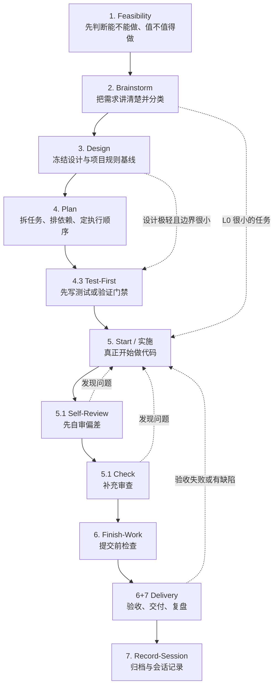

# 工作流全局流转说明（通俗版）

> 这份文档不是规则手册，而是“大局地图”。
> 目标是让你先看懂：这套 workflow 为什么这样设计、整条主链怎么走、什么时候该进哪一步。

相关文档：

- 想看权威规则：[工作流总纲](./工作流总纲.md)
- 想看阶段到命令的映射：[命令映射](./命令映射.md)
- 想看完整通用 walkthrough：[多CLI通用新项目完整流程演练](./多CLI通用新项目完整流程演练.md)
- 想看外部项目专项案例：[完整流程演练](./完整流程演练.md)

---

## 一句话理解这套 Workflow

这套流程的核心思想只有一句话：

**先判断值不值得做，再把需求说清楚，再冻结设计和检查门禁，最后才进入实现、审查、交付和记录。**

它要解决的不是“怎么让 AI 多写点代码”，而是下面四件事：

- 不让项目一开始就带着模糊需求往下冲
- 不让实现阶段边想边改、最后返工
- 不让不同 CLI 各说各话、入口混乱
- 不让任务做完之后没有证据、没有收尾、没有沉淀

在真正使用前，只要先记住一个前提：

- 目标项目必须本身是 Git 项目
- 并且已经执行过 `trellis init`
- 并且能检测到 `trellis init` 产物，例如 `.trellis/.version`

也就是说，先在目标项目执行 `trellis init`，再运行当前 workflow 自带的安装脚本，把 workflow 安装到目标项目；安装完成后，再在目标项目里按对应 CLI 的原生入口使用。

---

## 先记住这张总图

---

## 把它当成“三层系统”

### 第 1 层：业务推进主链

就是上面那条主线：

`可行性评估 → 需求澄清 → 设计 → 计划 → 测试先行 → 实施 → 审查 → 交付 → 记录`

这条链解决的是“项目现在应该往哪走”。

### 第 2 层：门禁

每一阶段不是做完就自动往下跳，而是要过门禁。

例如：

- 没有 `assessment.md`，就不该直接进 `brainstorm`
- PRD 没冻结，就不该直接进 `design`
- 项目 spec 和检查矩阵没对齐，就不该直接进 `plan`
- 没有测试/验证证据，就不该直接说“完成了”
- 任务没 archive、session 没 clean，就不算真正收尾

### 第 3 层：CLI 入口适配

同一条 workflow 主链，会被映射到三个 CLI：

- Claude Code
- OpenCode
- Codex

**主链相同，入口协议不同。**

---

## 三种 CLI 怎么进入同一条主链

| CLI | 你怎么进入阶段 | 记忆方法 |
|-----|---------------|---------|
| Claude Code | `/trellis:<phase>` | 把它当“项目命令入口” |
| OpenCode | TUI 用 `/trellis:<phase>`；CLI 用 `trellis/<phase>` | 同样是命令入口，只是 CLI 语法不同 |
| Codex | 自然语言描述当前意图，或显式触发同名 skill | 不走项目级 `/trellis:*` 目录 |

最重要的不是语法，而是这一点：

- Claude / OpenCode：以**项目命令**为主入口
- Codex：以 **AGENTS.md + hooks + skills + subagents** 为主入口

所以你看到文档里总在强调：

**多 CLI 同装，不等于同一入口协议。**

---

## 每个阶段到底在干什么

## 1. Feasibility

这一步不讨论“怎么实现”，先回答：

- 这个项目能不能做
- 值不值得做
- 风险大不大
- 是否允许继续进入需求阶段

产出重点：

- `assessment.md`

如果是外部项目，还要在这里先定：

- 交付控制轨道
- 最终移交触发条件
- 尾款前哪些控制权保留在开发者侧

一句话理解：

**先做接单/立项判断，不要把不该接的项目一路推进到实现阶段。**

## 2. Brainstorm

这一步不是立刻拆任务，而是先把需求说准确。

这里主要做四件事：

- 判断需求是否已经清楚
- 做复杂度分类：`L0 / L1 / L2`
- 判断是否还要补信息
- 判断是不是要拆成多个子任务

最关键的判断：

- `L0`：很小，单上下文能闭环，可以直接进 `start`
- `L1`：标准任务，通常进 `plan`
- `L2`：复杂任务，先发散补信息，再进 `plan`

一句话理解：

**这一步解决“到底要做什么”和“这事有多大”。**

## 3. Design

需求清楚后，先冻结关键设计，不要直接写代码。

这里主要解决：

- 方案和接口怎么定
- 项目 spec 该导入哪些
- 自动化检查矩阵是什么
- `finish-work` 和 `record-session` 的项目化门禁怎么定

一句话理解：

**这一步解决“以后按什么标准做和验”。**

## 4. Plan

这一步不是写设计，而是把设计变成可执行任务。

这里要产出：

- `task_plan.md`
- 任务依赖关系
- 任务执行矩阵
- 哪些任务能并行、哪些必须串行

一句话理解：

**这一步解决“先做什么、后做什么、哪些能同时做”。**

## 4.3 Test-First

这是把“怎么证明你做对了”提前。

核心不是追求形式化 TDD，而是先把验证门禁写出来：

- 测什么
- 怎么测
- 什么算通过

一句话理解：

**先定义验收方式，再开始真正实现。**

## 5. Start / 实施

这是实际写代码、改文档、落实现的阶段。

但这里有一个限制：

- 一次只在当前上下文推进一个任务
- 如果有 `task_plan.md`，先按任务执行矩阵选一个 `可开始` 任务做

一句话理解：

**真正开工，但要按计划推进，不是想到哪改到哪。**

## 5.1 Self-Review / Check

这两步是“先自己看，再补充审查”。

区别可以这么记：

- `self-review`：先对照 spec 和目标自查
- `check`：做补充审查，确认没有明显漏项

一句话理解：

**先自己找偏差，再让流程把明显遗漏再筛一遍。**

## 6. Finish-Work

这一步是提交前检查，不是最终交付。

重点是确认：

- 该跑的检查都跑了
- 该补的 spec / 文档都补了
- 当前变更已经达到“可提交”状态

一句话理解：

**这是“准备交作业”，不是“作业已经交完”。**

## 6+7 Delivery

这里处理的是：

- 验收测试
- 交付物整理
- 变更日志
- 复盘与 learn 沉淀

如果是外部项目，这里还要判断：

- 本次只是 retained-control delivery
- 还是已经满足 final control transfer

一句话理解：

**这一步解决“怎么把结果交出去，并把经验留下来”。**

## 7. Record-Session

最后一步是收尾，不是可选项。

这里做两件事：

- archive 当前完成任务
- 记录本次 session，并完成 `.trellis/` 元数据闭环

一句话理解：

**不是“做完就结束”，而是“记录完成才真正闭环”。**

---

## 最容易卡住的 5 个分流点

## 分流 1：什么时候不能跳过 Feasibility

只要是这些场景，默认就先别直接 brainstorm：

- 新项目
- 新客户
- 外包/接单
- 不确定值不值得做

因为你先要得到一个结论：

- 接
- 谈判后接
- 暂停
- 拒绝

## 分流 2：什么时候可以直接 Start

只有这类情况才建议直接走：

- `L0`
- 单上下文可闭环
- 影响面很小
- 不需要重设计和复杂拆解

如果不满足，就别急着直接实现。

## 分流 3：什么时候必须走需求变更管理

只要 PRD 已冻结，后面又出现：

- 新增需求
- 修改需求
- 删除需求

就不要在当前阶段“顺手改一下”。

应该先把它视为正式变更，再评估影响。

只有“纯澄清”才能留在当前阶段处理。

## 分流 4：什么时候回到 Start 修复

下面这些阶段发现问题，通常都回到 `start`：

- `self-review`
- `check`
- `delivery`

因为这说明实现或交付材料还没达到门禁。

## 分流 5：什么时候算真正完成

必须同时满足：

- 当前任务已完成
- 该 archive 的已 archive
- `record-session` 完成
- `.trellis/workspace` / `.trellis/tasks` clean

如果 session 记录了，但 metadata 没闭环，仍然不算完成。

---

## 第一次使用时，最实用的记忆方式

你不需要背全部细节，只要记住这套口诀：

### 口诀版

1. 先判断值不值得做
2. 再把需求说清楚
3. 冻结设计和规则
4. 拆成可执行任务
5. 先定义怎么验证
6. 再真正开始实现
7. 做完先自审再检查
8. 通过后再交付
9. 最后 archive + record-session

### CLI 入口版

- Claude Code：`/trellis:xxx`
- OpenCode：TUI `/trellis:xxx`，CLI `trellis/xxx`
- Codex：说意图，或显式触发同名 skill

### 不确定下一步版

- Claude / OpenCode：优先 `start`
- Codex：描述当前意图，或显式触发 `start` skill

---

## 建议阅读顺序

如果你是第一次接触，按这个顺序看最省力：

1. 先看本文，建立全局地图
2. 再看 [多CLI通用新项目完整流程演练](./多CLI通用新项目完整流程演练.md)，理解主链
3. 再看 [命令映射](./命令映射.md)，理解不同 CLI 怎么进同一条链
4. 最后按需查 [工作流总纲](./工作流总纲.md) 和具体 `commands/*.md`

---

## 最后一句提醒

这套 workflow 最容易误解的地方，不是阶段太多，而是把它当成“命令清单”。

更准确的理解应该是：

**它是一条带门禁的项目推进主链，命令、skills、hooks、agents 只是把这条主链挂到不同 CLI 上的承载方式。**
