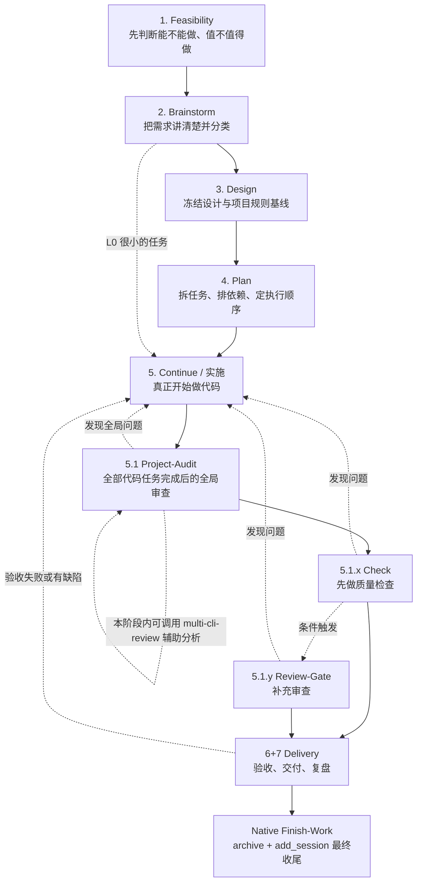

# 工作流全局流转说明（通俗版）

> 这份文档不是规则手册，而是“大局地图”。
> 目标是让你先看懂：这套 workflow 为什么这样设计、整条主链怎么走、什么时候该进哪一步。

相关文档：

- 想看权威规则：[工作流总纲](./工作流总纲.md)
- 想看阶段到命令的映射：[命令映射](./命令映射.md)
- 想看安装后 / 升级后的隐藏目录核对：[装后隐藏目录与托管边界核对清单](./装后隐藏目录与托管边界核对清单.md)
- 想看完整通用 walkthrough：[多CLI通用新项目完整流程演练](./多CLI通用新项目完整流程演练.md)
- 想看外部项目专项案例：[完整流程演练](./完整流程演练.md)

---

## 一句话理解这套 Workflow

这套流程的核心思想只有一句话：

**先判断值不值得做，再把需求说清楚，再冻结设计和检查门禁，最后才进入实现、审查、交付和记录。**

它要解决的不是“怎么让 AI 多写点代码”，而是下面四件事：

- 不让项目一开始就带着模糊需求往下冲
- 不让实现阶段边想边改、最后返工
- 不让不同 CLI 各说各话、入口混乱
- 不让任务做完之后没有证据、没有收尾、没有沉淀
- 不让源码交付后缺少作者归属证明、水印说明和验证记录

在真正使用前，只要先记住一个前提：

- 目标项目必须本身是 Git 项目
- `origin` 必须至少配置两个 push URL
- 并且已经执行过 `trellis init`
- 并且能检测到 `trellis init` 产物，例如 `.trellis/.version`

如果还没配好 `origin` 的双 push URL，可以按这三步做：

```bash
git remote add origin <你的第一个远程仓库URL>
git remote set-url --add --push origin <第一个仓库URL>
git remote set-url --add --push origin <第二个仓库URL>
```

若 `origin` 已存在，跳过第一条。

也就是说，先在目标项目执行 `trellis init`，再运行当前 workflow 自带的安装脚本，把 workflow 安装到目标项目；安装脚本会自动导入需求发现基础资产，其中默认包含需求发现规范与项目级 `README` 双语治理规则；若目标项目存在 `00-bootstrap-guidelines`，也会一并清理；若遗留的 repo-global `.current-task` 仍指向它，也会作为兼容清理一并移除（不存在则跳过）；安装完成后，先按《[装后隐藏目录与托管边界核对清单](./装后隐藏目录与托管边界核对清单.md)》做一次核对，再在目标项目里按对应 CLI 的原生入口使用。

最少要确认：

- `.trellis/workflow-installed.json`、`.trellis/workflow.md`、`.trellis/library-lock.yaml` 都处于预期状态
- `.trellis/spec/universal-domains/project-governance/readme-governance/` 已导入，能约束 `README.md` 默认中文与 `README.en.md` 同步更新
- `AGENTS.md` 里的 `TRELLIS` managed block 和 `workflow-nl-routing` 区段都还在
- `.agents/skills/` 与 `.codex/skills/` 的实际状态都被检查过，而不是只看前者
- Claude/OpenCode 的阶段可用性已先按 `.claude/commands/trellis/` / `.opencode/commands/trellis/` 判断，而不是只看各自 `skills/` 目录数量
- `.backup-original/` 已按恢复面而不是 residual defect 口径复核；存在本身不算异常
- 对 Codex：先看 `.agents/skills/` 这个主承载面，再看 `.codex/skills/` secondary carrier；缺少 `.codex/commands/` 不单独构成异常
- `.codex/hooks.json`、`.codex/hooks/inject-workflow-state.py`、`.claude/settings*.json`、`opencode.json.instructions` 这类手动维护资产没有被误当成“安装器会自动补齐”

---

## 先记住这张总图


```mermaid
flowchart TD
    A[1. Feasibility<br/>先判断能不能做、值不值得做] --> B[2. Brainstorm<br/>把需求讲清楚并分类]
    B --> C[3. Design<br/>冻结设计与项目规则基线]
    C --> D[4. Plan<br/>拆任务、排依赖、定执行顺序]
    D --> F[5. Continue / 实施<br/>真正开始做代码]
    F --> G[5.1 Project-Audit<br/>全部代码任务完成后的全局审查]
    G --> H[5.1.x Check<br/>先做质量检查]
    H --> K[6+7 Delivery<br/>验收、交付、复盘]
    H -. 条件触发 .-> I[5.1.y Review-Gate<br/>补充审查]
    I --> K
    K --> L[Native Finish-Work<br/>archive + add_session 最终收尾]

    B -. L0 很小的任务 .-> F
    G -. 发现全局问题 .-> F
    G -. 本阶段内可调用 multi-cli-review 辅助分析 .-> G
    H -. 发现问题 .-> F
    I -. 发现问题 .-> F
    K -. 验收失败或有缺陷 .-> F
```

说明：

- `Delivery` 在这套 workflow 中承担 `§6+§7` 的验收、交付与复盘语义
- `Finish-Work` / `trellis-finish-work` 是当前 fresh baseline 的收尾入口，使用 Trellis 原生 `/finish-work`；归档与 session 记录在 `/finish-work` 阶段执行，顺序是先 `archive` 再 `add_session.py`

---

## 把它当成“三层系统”

### 第 1 层：业务推进主链

就是上面那条主线：

`可行性评估 → 需求澄清 → 设计 → 计划 → 实施 → 审查 → 交付 → 记录`

这条链解决的是“项目现在应该往哪走”。

### 第 2 层：门禁

每一阶段不是做完就自动往下跳，而是要过门禁。

当前版本再加一条硬规则：

- 当前阶段不能靠“感觉”判断，而是只看 `session-scoped active task -> 当前阶段任务 -> workflow-state.json`
- `feasibility` / `brainstorm` / `design` / `plan` 可以由 parent coordinator task 暂时持有阶段状态；只有进入 `implementation` 等执行态前，才必须切到真实叶子任务
- 当前 session 无法解析 active task 时，不能自动判断现在在哪个阶段
- 每个阶段做完后，先停在“等待用户确认”，用户点头后才能切到下一阶段

例如：

- 新建目标项目的本地主分支/初始分支应在**第一次进入 workflow** 前统一为 `main`；若此时还没有有效 `assessment.md`，外包/对外交付项目就应先进入 `feasibility`
- 默认不应在缺少 `assessment.md` 时直接进 `brainstorm`；当前唯一例外是 personal profile 的首次入口，可在 `brainstorm` 内补齐 assessment 最低基线，但未补齐前不得离开本阶段
- PRD 没冻结，就不该直接进 `design`
- 项目 spec 和检查矩阵没对齐，就不该直接进 `plan`
- 没有测试/验证证据，就不该直接说“完成了”
- 任务没 archive、session 没 clean，就不算真正收尾

### 第 3 层：CLI 入口适配

同一条 workflow 主链，会被映射到三个 CLI：

- Claude Code
- OpenCode
- Codex

**主链相同，入口协议不同。**

---

## 三种 CLI 怎么进入同一条主链

| CLI | 你怎么进入阶段 | 记忆方法 |
|-----|---------------|---------|
| Claude Code | `/trellis:<phase>` | 把它当“项目命令入口” |
| OpenCode | TUI 用 `/trellis:<phase>`；CLI 用 `trellis/<phase>` | 同样是命令入口，只是 CLI 语法不同 |
| Codex | 自然语言描述当前意图，或显式触发同名 skill | 不走项目级 `/trellis:*` 目录 |

最重要的不是语法，而是这一点：

- Claude / OpenCode：以**项目命令**为主入口
- Codex：以 **AGENTS.md + hooks + skills** 为主入口；即使底层仍存在 `subagents` carrier，也视为被当前嵌入 workflow 显式禁用的路径，不得当作公开或内部执行入口。其中 `.agents/skills/` 是共享 workflow skills 的唯一主承载面，也是当前证据下 Codex 的 repo-scoped skills 主入口，`.codex/skills/` 是 `trellis init` 后可能出现的 secondary carrier；详见 `commands/codex/README.md`
- OpenCode 官方也会发现 `.agents/skills/`，但当前 workflow 对 OpenCode 的正式入口仍是 `.opencode/commands/trellis/`；这里对 OpenCode 只是共享承载面，不是推荐入口
- Claude Code 当前没有官方证据表明会读取 `.agents/skills/`
- 维护者侧例外：当前 repo-local `workflow-audit` 这条审计链必须在 Claude Code / OpenCode 主会话中执行，不得走 agent 执行路径；只有后续明确调整合同后才可放开

所以你看到文档里总在强调：

**多 CLI 同装，不等于同一入口协议。**

---

## 每个阶段到底在干什么

## 1. Feasibility

这一步不讨论“怎么实现”，先回答：

- 这个项目能不能做
- 值不值得做
- 风险大不大
- 是否允许继续进入需求阶段

开始前还要先看一眼仓库基线：

- 如果这是新建目标项目，本地主分支和初始分支应该就是 `main`
- 如果这是已有提交历史的存量项目，不强制改成 `main`，但要把当前分支现状记清楚

产出重点：

- `assessment.md`
- 法律/合规风险结论 + 红线检查结论（所有项目必填）
- `project_engagement_type`（所有项目必填）

当前 workflow 的常规默认值里，作者归属保护继续按启用处理；除非项目明确决定 `ownership_proof_required = no`，否则这里就要一起冻结：

- `source_watermark_level`
- `source_watermark_channels`
- `zero_width_watermark_enabled`
- `subtle_code_marker_enabled`
- `ownership_proof_required`

如果是外部项目，还要在这里先定：

- 启动款比例
- 启动款是否已到账
- 交付控制轨道
- 最终移交触发条件
- 尾款前哪些控制权保留在开发者侧

这里有一个容易混淆但必须记住的点：

- 所有项目都先完成项目类别判断与 `assessment.md` 基线；外包/对外交付项目默认先走 `feasibility`，personal profile 首次入口可在 `brainstorm` 内补齐这组基线
- 非外部项目继续走主链，但不启用首/尾款控制
- 外部项目一旦判定成立，启动款门禁和最终移交门禁就都变成强制动作，不能只做分类不执行

一句话理解：

**先做接单/立项判断，不要把不该接的项目一路推进到实现阶段。**

## 2. Brainstorm

这一步不是立刻拆任务，而是先按 Trellis 原生的需求发现方式，把需求说准确、把上下文补齐。

这里主要做六件事：

- 先确认 `feasibility` 已执行且 `assessment.md` 仍有效
- 再建好或复用 `task_dir/prd.md`
- 先自己读上下文、做必要调研，能查不问
- 判断需求是否已经清楚
- 做复杂度分类：`L0 / L1 / L2`
- 判断是否还要补信息
- 判断是不是要拆成多个子任务
- 离开前先补齐项目级粗估：`task_dir/prd.md` 写 `## 项目级粗估`，目标项目 `customer-facing-prd.md` 写 `## 项目级粗估摘要`
- 离开前再补一段 `## 阶段出口快照`，至少写清：
  - `complexity_decision`
  - `ui_lane_decision`
  - `cross_platform_scope`
  - `estimate_refresh_result`
  - `kill_criteria`
  - `open_items`
- 这组字段不只是“出现过就算完成”：当前 workflow 会检查它们是否存在且不是明显占位值；其中 `complexity_decision` 在直达 implementation 时还必须是 `L0`
- 离开前先补齐目标项目的 `customer-facing-prd.md`；`developer-facing-prd.md` 等到 design 阶段技术架构确认后再正式生成
- 若调研后只剩一个可信方向，也要明确写“当前无可比方案”，不要硬凑多方案对比

最关键的判断：

- `L0`：很小，当前事项无需继续细分即可达到合适任务粒度，可以直接进 `implementation`
- `L1`：标准任务，通常进 `plan`
- `L2`：复杂任务，先发散补信息，再进 `plan`

一句话理解：

**这一步解决“到底要做什么”“先查什么”“这事有多大”“下一步该走哪”。**

并且在真正离开 `brainstorm` 前，要先把“这件事大概要花多久”写成**不可跳过的粗估门禁**，不能只在聊天里口头说一下。

## 3. Design

需求清楚后，先冻结关键设计，不要直接写代码。

这里主要解决：

- 方案和接口怎么定
- 系统边界、外部依赖、ownership 边界怎么定
- 项目 spec 该导入哪些
- 自动化检查矩阵是什么，采用 Sonar 的项目必须写真实命令，未采用时必须写替代门禁和原因
- Trellis 原生 `/finish-work` 的项目化门禁怎么定
- 技术架构确认后，按块 A / B / C / D 分段落盘什么内容
- 源码水印在当前 workflow 中默认启用，需要在 Design 阶段想清楚怎么设计、怎么拆任务、怎么验证；只有项目明确写 `ownership_proof_required = no` 才能跳过这条链路

如果项目涉及 UI 原型，还要额外守住一条边界：

- 先在当前 CLI 调 `ui-ux-pro-max` 产出页面布局粗稿、组件建议和交互流程；其他 UI skill 再按“平台 + 框架 + 样式栈 + 当前阶段”命中条件调用
- 推荐链路固定为：`uiprompt.site -> STITCH-PROMPT（Stitch DESIGN.md 语义）-> Stitch 首版 -> Figma 风格校正`
- `design/STITCH-PROMPT.md` 中，UI 界面默认中文，给 Stitch 的执行 prompt 默认英文
- Figma 只作为整体视觉风格参考，不作为具体内容布局照抄依据
- 原型只用于验证交互/视觉结论
- 原型文件、原型导出代码、临时网页源码都不能直接当正式实现输入
- 允许带入实现的只能是已经转写好的结构化设计结论

其中后半段的直观理解是：

- 块 A：生成 `developer-facing-prd.md`
- 块 B：正式设计文档
- 块 C：`README.md`（默认中文） / `README.en.md` / 项目 docs
- 块 D：spec、检查矩阵、Trellis 原生 `/finish-work`

并且 design 退出前，`TAD.md` 不只是“有这个文件”就够，至少还要把下面几块写出来：

- `## 架构冻结清单`
- `## 系统边界与外部依赖`
- `## 风险与回退`
- `## 阶段出口快照`

其中 `developer-facing-prd.md` 至少要能看见三类信息：

- 依赖与约束
- 接口与集成
- 错误处理与边界情况

若 `ownership_proof_required = yes`，还要额外冻结：

- `$TASK_DIR/design/source-watermark-plan.md`
- `WMID`
- 零宽字符水印边界（只允许注释 / 文档字符串 / Markdown）
- 不起眼代码标识的允许位置与禁区
- 后续交付要用到的 `ownership-proof.md` 与 `source-watermark-verification.md`

每块做完都要停下来等用户确认，不能一口气跑完整个 design 阶段。

一句话理解：

**这一步解决“以后按什么标准做和验”。**

## 4. Plan

这一步不是写设计，而是把设计变成可执行任务。

这里要产出：

- `task_creation_checklist.md`（真实创建 Trellis task 前的人类确认清单）
- `task_plan.md`（只保留摘要，真实执行依赖 Trellis task）
- 真实 Trellis task / 子任务
- 任务依赖关系
- 项目域执行策略
- 早期探针与骨架任务（walking skeleton / packaging skeleton / performance probe）
- 自动化策略摘要（本地 vs CI）
- 范围收敛与降级预案（kill criteria / P1 候选）
- 门禁摘要和任务图摘要
- 阶段出口快照
- 当前推荐执行任务说明卡
- 当前推荐 leaf task 的最小 `prd.md`

这里还会先做一次“能不能拆”的 readiness gate：

- 如果目标、范围、验收、关键依赖还没清楚，就停在 `plan`
- 先回 `brainstorm` / `design` 补信息，不硬拆 task
- 吸收的是 Trellis 原生 `plan agent` 的 readiness 优点，不是恢复 `plan -> dispatch` 自动链
- 在 readiness gate 通过后，也不能直接创建真实 task；还必须先生成 `task_creation_checklist.md` 并获得人工确认

无论项目是否启用源码水印，这一步都必须额外拆出一个主干后的固定 task：

- `性能回归与优化任务`
- 它位于目标主干任务链之后
- 它负责对主干完成后的体积 / 启动时间 / 内存 / 响应速度等适用指标做回归对比与优化闭环

当前 workflow 的常规默认值下，这一步默认还要把下面这些拆成真实 task；只有明确写了 `ownership_proof_required = no` 才能跳过：

- 可见源码水印
- 零宽字符水印（若启用）
- 隐蔽代码标识（若启用）
- 水印验证
- 归属证明包

同时要记住一个硬限制：

- `plan` 只做规划，不做执行
- 不允许在这个阶段生成基础代码、写实现代码、顺手开始某个 task
- 不允许在 `task_creation_checklist.md` 获得人工确认前就真实创建 Trellis task
- 完成后只能停在”等待用户确认是否进入 implementation”
- 在技术上，这个边界还会由 `workflow-state.py` 检查：`plan` 阶段的 `execution_authorized` 必须保持为 `false`

一句话理解：

**这一步解决“先确认要建哪些 task，再真正创建它们；主干后的固定性能任务是什么；当前要开的 leaf task 是否 ready，以及下一步到底准备开哪个 task”。**

## 4.3 Test-First

这是一个**手动入口**，不是默认主链步骤。

默认情况下，进入某个 task 实现前会由 `continue` 自动执行 `before-dev`，并把当前 task 的验证门禁补到 `before-dev.md`。

只有明确要 TDD / 先补测试证据时，才显式进入这里。

核心仍然是把“怎么证明你做对了”写清楚：

- 测什么
- 怎么测
- 什么算通过

一句话理解：

**默认主链自动补 task 门禁；只有需要显式先测时才手动进这里。**

## 5. Continue / 实施

这是实际写代码、改文档、落实现的阶段。

但这里有一个限制：

- 一次只在当前上下文推进一个任务
- 如果有 `task_plan.md`，先按 task 图摘要选定当前要做的真实 task
- 在真正开工前，先用任务说明卡把当前 task 的目标、边界、依赖、验收和风险说清楚
- 进入实现前，`continue` 会自动执行 `before-dev`
- 自动生成或刷新当前 task 的 `before-dev.md`
- 不要求用户显式输入 `/trellis:before-dev`
- 当前嵌入 workflow 显式禁用 `trellis-research -> trellis-implement -> trellis-check` 这条 agent/subagent 执行路径；即使目标项目仍存在这些 carrier，也不得派发，默认由主会话直接完成对应 research / implement / check
- 这里的 `trellis-check` 只是 implementation 内部自检 agent，不等于正式 `/trellis:check`
- implementation 内部链跑完后，仍要等用户确认，才能进入正式 `/trellis:check`

一句话理解：

**真正开工，但要先选中具体 task，并在开工前自动补齐当前 task 的门禁；默认由主会话直接完成 research / implement / check，再进正式 check。**

## 5.1 Project-Audit

这一步不是每个小任务做完都跑，而是：

- 当全部代码相关任务完成后
- 先站在项目全局角度回看一次所有代码
- 做统一的查缺补漏

它固定分三步：

- 先分析并和用户讨论
- 再确认修正方案
- 最后再统一修改

另外，这一步还要补两类只适合在项目整体视角统一执行的检查：

- 项目级统一代码漏洞检测
- 项目级统一代码质量总检

一句话理解：

**不是看单任务对不对，而是看整个项目放在一起有没有漏、有没有错、有没有不一致。**

如果项目采用了 `task_plan.md` 的任务图摘要，`PROJECT-AUDIT` 的触发条件也应在摘要里写清；同时 `性能回归与优化任务` 必须在主干之后、`PROJECT-AUDIT` 之前落位。正式执行仍以真实 Trellis task 的完成情况为准。

完成这一步后，还不能直接关闭当前任务；要先进入下面的任务级质量门禁：正式 `Check`，必要时再走 `Review-Gate`，然后进入 `Delivery`。`Review-Gate` 只属于任务级高风险项的补充门禁，不是 `project-audit` 的默认后续阶段。任务级 `review-gate` 默认分成两档：`recommended -> lite(1 reviewer)`，`required -> full(2 reviewer)`；如果 `lite` 没发现新问题，可以直接关闭，不必强制进入 `multi-cli-review-action`。如果 `project-audit` 里的某个问题自己拿不准，也可以在本阶段内部叫其他 CLI 帮忙看（用 `multi-cli-review`），但这不等于进入 `review-gate`。这里固定按 full 口径处理：默认会叫 2 个 CLI 帮忙看，最多 4 个，一般建议在 3 轮内收敛；当前 CLI 也不是拿到 reviewer 报告就直接改，而是先汇总确认，再决定修哪些。

## 5.1.x Check

这一步是先自己做一轮质量检查。

重点是：

- `check`：先对照 spec 和目标做质量检查

一句话理解：

**先自己找偏差，确认本轮实现有没有明显问题。**

## 5.1.y Review-Gate（条件触发）

这一步不是每个任务都走。默认只有命中 `review-gate` 的硬条件，或用户显式要求进入补充审查时才触发；若只是验证证据明显不足，则属于 `recommended` 而不是强制进入。

重点是：

- `review-gate`：判断是否需要其他 CLI 补充审查，不是默认步骤；`L2` 本身不等于自动触发，仍需命中明确硬条件，或由软条件判到 `recommended`
- 普通任务从 `check` 直接进 `delivery`，是否再进入原生 `finish-work` 取决于当前轮是否需要关闭当前 active task
- 如果进入多 CLI 审查，默认会给 reviewer 分配字母槽位 `a` / `b` / `c` / `d`；到底是哪一个 CLI 执行了某个槽位，要看 reviewer 报告里的 `source-cli`

一句话理解：

**高风险项多筛一层，普通任务直接跳过。**

## 6+7 Delivery

这一步是项目级验收与交付，不是单任务归档。

重点是确认：

- 验收结果清晰
- 交付物已整理
- 当前 task 的 `finish-work-checklist.md` 与 `delivery/*` 证据已齐
- 当前轮已经达到“可交付 / 可收尾”的状态

这里处理的是：

- 验收测试
- 交付物整理
- 变更日志
- 复盘与 learn 沉淀

最少要整理清楚：

- `delivery/acceptance.md`
- `delivery/deliverables.md`
- 对外项目交付事件中的 `transfer-checklist.md`

如果是外部项目，这里还要判断：

- 本次只是 retained-control delivery
- 还是已经满足 final control transfer

一句话理解：

**这一步解决“怎么把结果交出去，并把经验留下来”。**

## Native Finish-Work

最后一步是收尾，不是可选项。当前 fresh baseline 使用 Trellis 原生 `/finish-work` 完成收尾。

这里做两件事，顺序固定：

- 先 archive 当前完成任务
- 再通过 `add_session.py` 记录本次 session，完成 `.trellis/` 元数据闭环

一句话理解：

**不是“做完就结束”，而是“记录完成才真正闭环”。**

---

## 最容易卡住的 5 个分流点

## 分流 1：什么时候不能跳过 Feasibility

只要是这些场景，默认就先别直接 brainstorm：

- 新项目
- 新客户
- 外包/接单
- 不确定值不值得做

因为你先要得到一个结论：

- 接
- 谈判后接
- 暂停
- 拒绝

## 分流 2：什么时候可以直接 Start

只有这类情况才建议直接走：

- `L0`
- 当前事项无需继续细分即可达到合适任务粒度
- 影响面很小
- 不需要重设计和复杂拆解

如果不满足，就别急着直接实现。

## 分流 3：什么时候必须走需求变更管理

只要 PRD 已冻结，后面又出现：

- 新增需求
- 修改需求
- 删除需求

就不要在当前阶段“顺手改一下”。

应该先把它视为正式变更，再评估影响。

只有“纯澄清”才能留在当前阶段处理；如果拿不准它到底是不是纯澄清，就默认按正式变更处理，不要先在当前阶段吸收。

## 分流 4：什么时候回到 Continue / Implementation 修复

下面这些阶段发现问题，通常都回到 `continue` / implementation：

- `check`
- `review-gate`
- `delivery`

因为这说明实现或交付材料还没达到门禁。

## 分流 5：什么时候算真正完成

必须同时满足：

- 当前任务已完成
- `finish-work` 已冻结 `finish-work-checklist.md` 与 close-out 证据
- `delivery` 已完成验收与交付物收口
- Trellis 原生 `/finish-work` 已执行 `archive` + `add_session.py`
- `.trellis/workspace` / `.trellis/tasks` clean

如果 session 记录了，但 metadata 没闭环，仍然不算完成。

---

## 第一次使用时，最实用的记忆方式

你不需要背全部细节，只要记住这套口诀：

### 口诀版

1. 先判断值不值得做（新项目首次入口需先确认 `main` 分支）
2. 再把需求说清楚
3. 冻结设计和规则
4. 拆成可执行任务
5. 进入 continue，自动补当前 task 的门禁
6. 再真正开始实现
7. 做完先做质量检查，再判断是否进入补充审查
8. 通过后再交付
9. 最后 delivery → Trellis 原生 `/finish-work`（执行 archive + session 记录）

### CLI 入口版

- Claude Code：`/trellis:xxx`
- OpenCode：TUI `/trellis:xxx`，CLI `trellis/xxx`
- Codex：说意图，或显式触发同名 skill

### 不确定下一步版

- Claude / OpenCode：优先 `continue`
- Codex：描述当前意图，或显式触发 `trellis-continue` skill

---

## 建议阅读顺序

如果你是第一次接触，按这个顺序看最省力：

1. 先看本文，建立全局地图
2. 再看 [多CLI通用新项目完整流程演练](./多CLI通用新项目完整流程演练.md)，理解主链
3. 再看 [命令映射](./命令映射.md)，理解不同 CLI 怎么进同一条链
4. 最后按需查 [工作流总纲](./工作流总纲.md) 和具体 `commands/*.md`

---

## 最后一句提醒

这套 workflow 最容易误解的地方，不是阶段太多，而是把它当成“命令清单”。

更准确的理解应该是：

**它是一条带门禁的项目推进主链，命令、skills、hooks、agents 只是把这条主链挂到不同 CLI 上的承载方式。**
